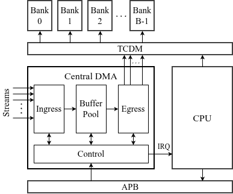

# Centralized Streaming DMA

A centralized DMA controller that ingests $n$ concurrent sensor streams, aggregates the data into 2D spatial blocks, and writes reordered data directly into a shared L2 memory.

---

## Datapath Components

* **Ingress Stage**
  * Consumes data across $n$ concurrent sensor stream interfaces.
  * Routes incoming elements into the intermediate buffer pool based on per-stream block configurations.
  * Detects completed blocks and notifies the egress stage.

* **Buffer Pool**
  * SRAM/register storage array that holds 2D spatial blocks across multiple rows.
  * Decouples the ingress interfaces from the egress memory ports.
  * Tracks buffer ownership states (empty, gathering, ready for egress).

* **Egress Stage**
  * Reads out completed blocks directly from the buffer pool.
  * Reorders data on the fly into the target access sequence without extra buffers.
  * Emits write transactions across multiple bus manager ports to the L2 crossbar.

* **Control Plane**
  * Manages global configuration, stream parameters, and buffer states.
  * Asserts an interrupt line to the CPU once a block transfer completes.

---

## Interfaces & Topology

* **Configuration:** APB subordinate port for config register access.
* **Memory Access:** Multiple manager ports to a multi-banked L2 memory via a TCDM crossbar.
* **Interrupts:** Dedicated line to the host CPU for transfer completion notifications.
* **Operation:** Fully autonomous after initial APB register setup.